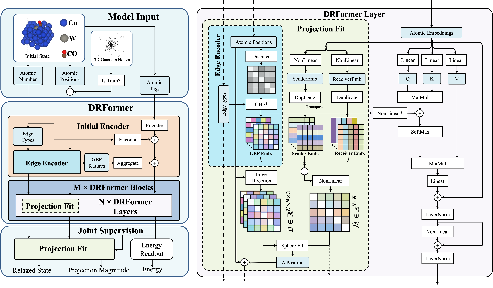
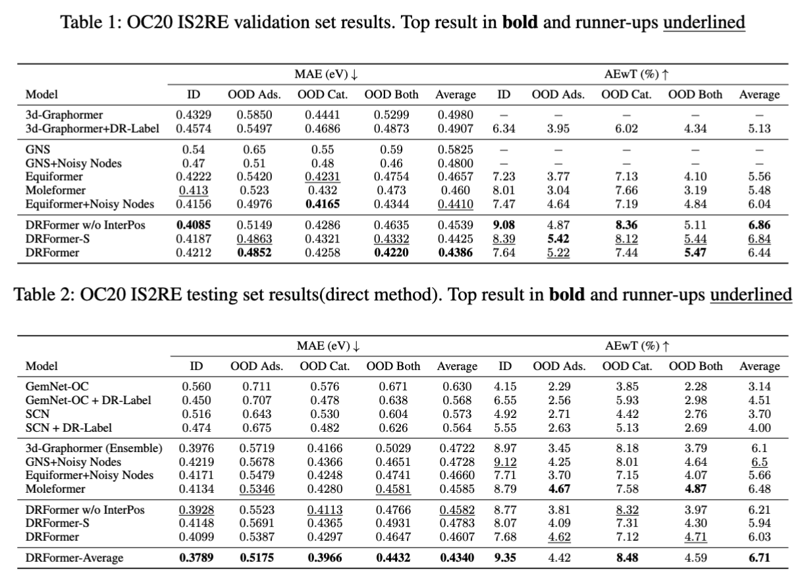
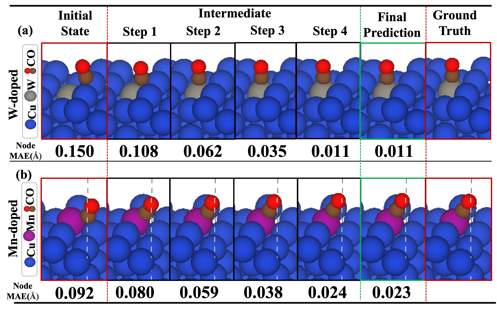

# DR-Label: Label Deconstruction and Reconstruction of GNN Models for Catalysis Systems

This repository hosts the official implementation of DRFormer, as presented in our paper "DR-Label: Label Deconstruction and Reconstruction of GNN Models for Catalysis Systems" for AAAI 2024.



## Usage

### Getting Started
- To begin, clone this repository to your local machine.
- DRFormer is extensively built upon Graphormer. For setting up the necessary environment, please refer to [Graphormer](https://github.com/microsoft/Graphormer.git) for creating the appropriate conda environment.
- Once you have established Graphormer's environment, integrate our modifications by replacing the `fairseq_cli` and `fairseq` directories with the contents from our `fairseq_mods` directory.

### Data Preprocessing

- Process the OC20 dataset using the script at "./graphormer/modules/outliers_cleaning.py". Store the processed results in "./examples/oc20/data/is2re_clean/all".

### Model Training

- To replicate the results of DRFormer-S as outlined in our paper, execute the following command:

```bash
fairseq-train --user-dir ./graphormer ./examples/oc20/data/is2re_clean/all --valid-subset val_id,val_ood_ads,val_ood_both,val_ood_cat --best-checkpoint-metric loss --num-workers 0 --task is2re --criterion mae_deltapos --arch IEFormer_ep_pp_deq --optimizer adam --adam-betas 0.9,0.98 --adam-eps 1e-6 --clip-norm 5 --lr-scheduler polynomial_decay --lr 3e-4 --warmup-updates 10000 --total-num-update 1000000 --batch-size 2 --dropout 0.0 --attention-dropout 0.1 --weight-decay 0.001 --update-freq 4 --seed 1 --tensorboard-logdir oc20_drlabel --embed-dim 768 --ffn-embed-dim 768 --attention-heads 48 --max-update 1000000 --log-interval 10 --log-format simple --save-interval 2 --validate-interval 2 --keep-interval-updates 10 --save-dir ./bw_checkpoint/DRFormer-S --layers 12 --blocks 4 --required-batch-size-multiple 1 --node-loss-weight 25 --use-fit-sphere --use-shift-proj --edge-loss-weight 50 --sphere-pass-origin --noisy-nodes --noisy-nodes-rate 1.0 --noise-scale 0.3 --noise-type normal --noise-in-traj --noisy-node-weight 1 --no-node-mask --full-dataset --explicit-pos --pos-update-freq 6 --noisy-label --noisy-label-downscale 1.0 --fix-atoms 
```


- To explore other variations of DRFormer, refer to the hyperparameter settings detailed in our paper.

### Results

Results on OC20:


Visualization of intermediate geometries:


## Acknowledgements

DRFormer is an advancement built upon significant prior work, particularly the study "Do Transformers Really Perform Badly for Graph Representation?". We extend our gratitude to the authors and contributors of the underlying research that has facilitated the development of DRFormer.

## Citation

